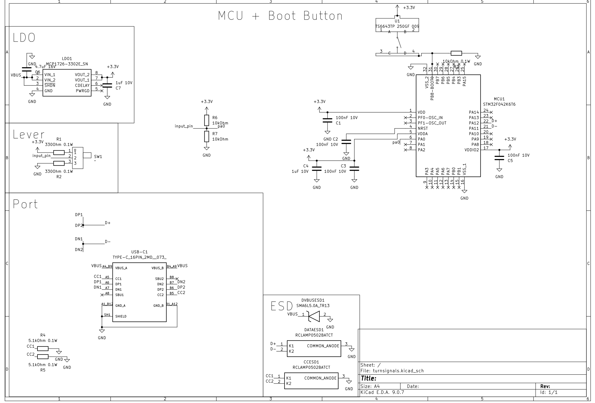
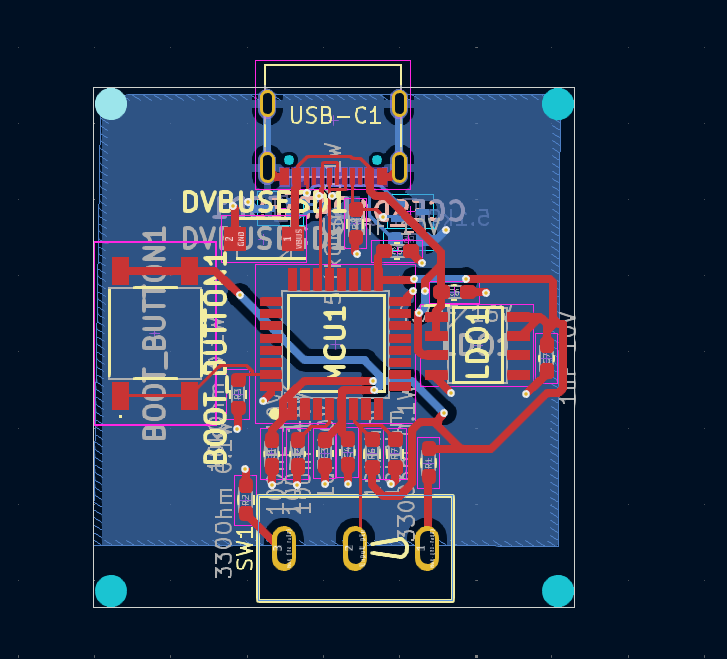
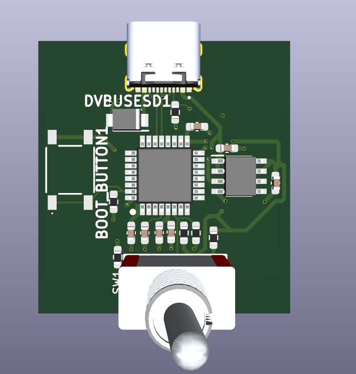
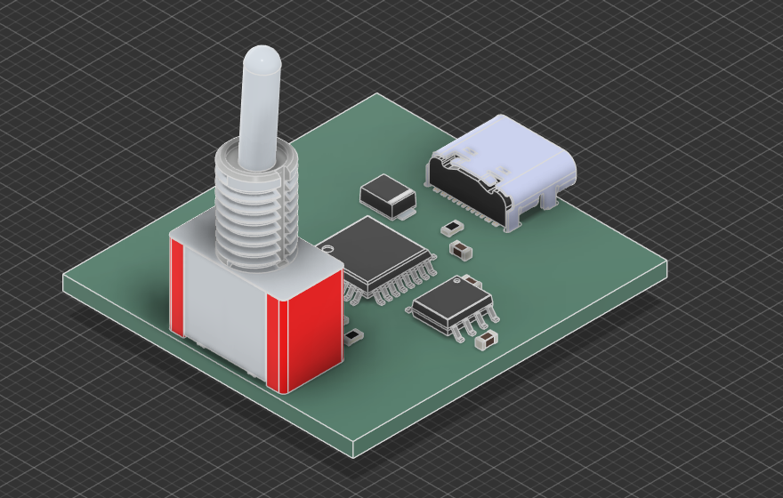
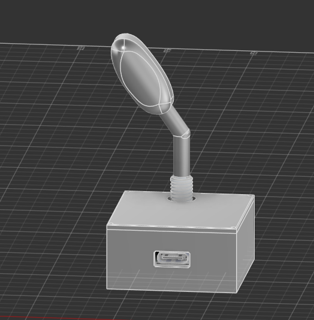
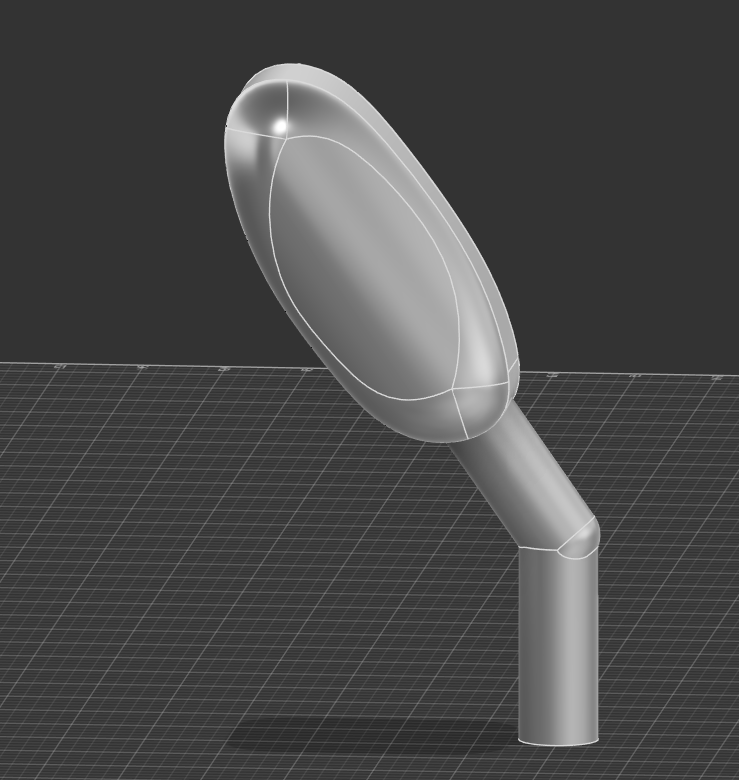
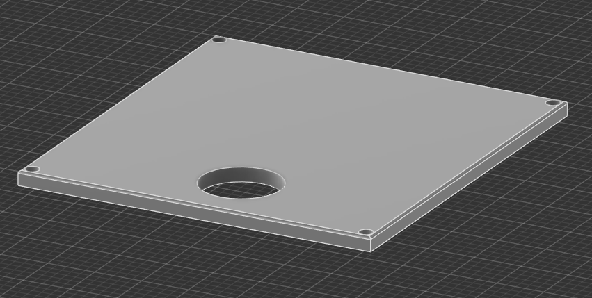
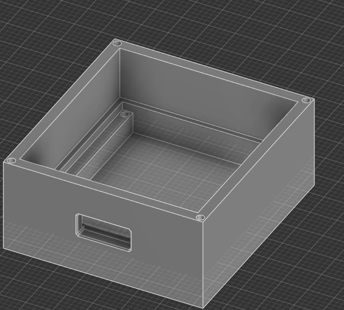

# turnsignals

Hello! This project is very simple, but to some people may be very needed, this is turnsignals module for PC steering wheels like logitech g29, made for HackClub's Blueprint program. It features USB-C (USB-FS standard) port for data and power and ESD protection on VBUS, DATA channels and CC channels! Firmware is given as whole STM32CubeIDE project. It is generated in STM32CubeMX and then the rest written in STM32CubeIDE

## Why i did this?

I want to get driving license soon. My biggest fear? Getting ticket for forgotting to signal a turn. My solution? Buy used PC steering wheel with pedals and gear shifter, make my own turnsignals and download some game where i can drive and use them. In this way i can make it my muscle memory.

# Images

Schematic

PCB

3D KiCad viewer

3D PCB

3D Assembled

3D Lever

3D Case (top)

3D Case (bottom)

# Datasheets & part list
Here you can find datasheet for every part and exact part number for it i used:
- MCU: [STM Electronics STM32F042K6T6 LQFP-32 Package](Datasheets/STM32F042K6T6.pdf)
- USB-C Port: [SHOU HAN TYPE-C 16PIN 2MD(073)](Datasheets/TYPE-C-16PIN-2MD(073).pdf)
- DATA and CC lines ESD diodes: [Semtech RCLAMP0502BATCT](Datasheets/RCLAMP0502BATCT.pdf)
- VBUS line ESD diode: [Yageo SMA6L5.0A_TR13](Datasheets/SMA6L5.0A_TR13.pdf)
- 3.3V LDO: [Microchip MCP1726-3302E_SNVAO](Datasheets/MCP1726-3302E_SNVAO.pdf)
- 4.7uF 16V Capacitor: [Murata Electronics GRM188Z71C475KE21D](Datasheets/GRM188Z71C475KE21D.pdf)
- 1uF 10V Capacitor: [Walsin 0603B105J100CT](Datasheets/0603B105J100CT.pdf)
- 100nF 10V Capacitor: [Vishay VJ0603Y104JXQCW1BC](Datasheets/VJ0603Y104JXQCW1BC.pdf)
- 5.1kOhm 0.1W Resistor: [Bourns CR0603-FX-5101ELF](Datasheets/CR0603-FX-5101ELF.pdf)
- 10Ohm 0.1W Resistor: [Vishay CRCW060310K0DHEAP](Datasheets/CRCW060310K0DHEAP.pdf)
- 300Ohm 0.1W Resistor: [GiantOhm GR0603J330RT5G00](Datasheets/GR0603J330RT5G00.pdf)
- BOOT button: [SHOU HAN TS6643TP 250gf 009](Datasheets/TS6643TP-250gf-009.pdf)
- Lever Toggle switch: [Dailywell 1MS1T1B1M1QES-5](Datasheets/1MS1T1B1M1QES-5.pdf)
# BOM
|Item                          |Description                 |Needed|Ordered|Why more/less?                   |Unit Price ($)|Total Price ($) |URL                                                                   |
|------------------------------|----------------------------|------|-------|---------------------------------|--------------|----------------|----------------------------------------------------------------------|
|ST STM32F042K6T6              |MCU                         |1     |1      |-                                |1.80$         |1.80$           |https://www.lcsc.com/product-detail/C69216.html                       |
|SEMTECH RCLAMP0502BATCT       |CC and DATA lines esd       |2     |0      |I have 3 left from other project |-             |-               |https://www.lcsc.com/product-detail/C117553.html                      |
|Littelfuse SMA6L5.0A          |VBUS line esd               |1     |1      |-                                |0.79$         |0.79$           |https://www.lcsc.com/product-detail/C1974860.html                     |
|MICROCHIP MCP1726-3302E/SN    |3.3V LDO                    |1     |1      |-                                |2.22$         |2.22$           |https://www.lcsc.com/product-detail/C635928.html                      |
|muRata GRM188Z71C475KE21D     |4.7uF capacitor             |1     |0      |I have 9 left from other project |-             |-               |https://www.lcsc.com/product-detail/C389010.html                      |
|Walsin 0603B105J100CT         |1uF capacitor               |2     |2      |-                                |0.03$         |0.06$           |https://www.lcsc.com/product-detail/C3841036.html                     |
|VISHAY VJ0603Y104JXQCW1BC     |100nF decap capacitor       |4     |5      |sold in increments of 5          |0.08$         |0.40$           |https://www.lcsc.com/product-detail/C3834925.html                     |
|SAMWHA CS1608X7R225K100NRB    |2.2uF capacitor             |2     |0      |I have 98 left from other project|-             |-               |https://www.lcsc.com/product-detail/C516003.html                      |
|BOURNS CR0603-FX-5101ELF      |5.1kOhm 0.1w CC resistor    |2     |0      |I have 8 left from other project |-             |-               |https://www.lcsc.com/product-detail/C2076779.html                     |
|VISHAY CRCW060310K0DHEAP      |10kOhm pull-up/down resistor|2     |0      |I have 3 left from other project |-             |-               |https://www.lcsc.com/product-detail/C3917708.html                     |
|SHOU HAN TS6643TP 250gf 009   |BOOT and NRST button        |2     |0      |I have 48 left from other project|-             |-               |https://www.lcsc.com/product-detail/C5342967.html                     |
|SHOU HAN TYPE-C 16PIN 2MD(073)|USB-C plug                  |1     |0      |I have 19 left from other project|-             |-               |https://www.lcsc.com/product-detail/C2765186.html                     |
|Shuntian PB1.6X4              |Mouting screws              |4     |10     |minimal order size is 10         |0.04$         |0.42$           |https://www.lcsc.com/product-detail/C357374.html?s_z=n_1.6x4          |
|Dailywell 1MS1T1B1M1QES-5     |Lever Toggle switch         |1     |1      |-                                |1.01$         |1.01$           |https://www.lcsc.com/product-detail/C496154.html?s_z=n_1MS1T1B1M1QES-5|
|PCB                           |PCB                         |1     |5      |5 is minimal order amount        |-             |7$+1.5$ delivery|https://jlcpcb.com/                                                   |

